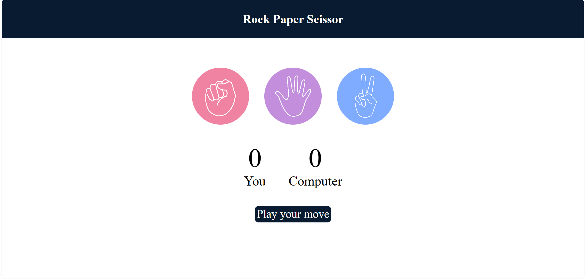
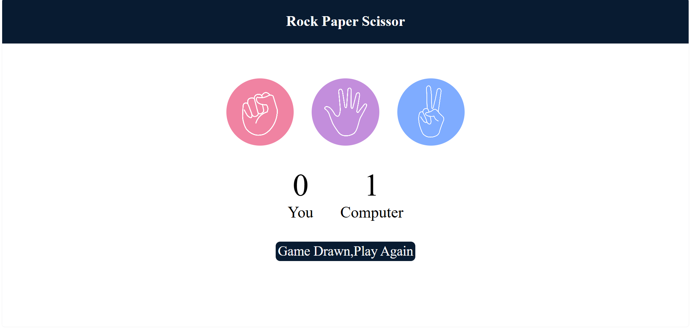
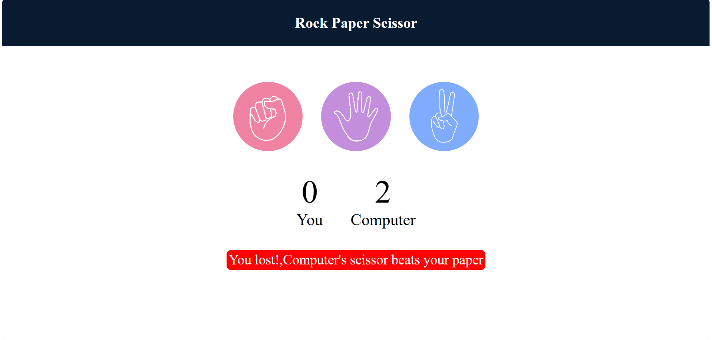
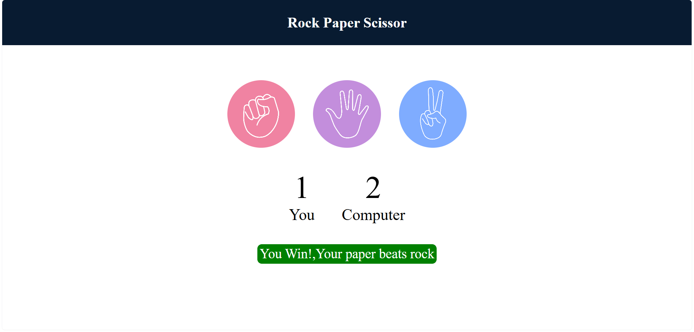

# Rock Paper Scissors Game 🪨📄✂️

A simple browser-based Rock Paper Scissors game built with **HTML, CSS, and JavaScript**, made while following the Apna College JavaScript course.

## Preview

## Features

- Click Rock, Paper, or Scissors to play against the computer
- Computer randomly generates its choice
- Live score tracking for both player and computer
- Win / Lose / Draw messages with color-coded feedback
- Fully responsive, clean UI

## Tech Stack

- **HTML** – structure
- **CSS** – styling and layout
- **JavaScript** – game logic and DOM manipulation

## How to Play

1. Clone or download this repository
2. Open `index.html` in your browser
3. Click on Rock, Paper, or Scissors to make your move
4. The computer makes its move automatically
5. The winner is announced and the scoreboard updates

## Project Structure
├── index.html # Game markup
├── rps.css # Styling
├── rps.js # Game logic
└── README.md

## What I Learned

- DOM selection and event listeners (`querySelectorAll`, `addEventListener`)
- Writing conditional logic to compare user vs. computer choices
- Updating the DOM dynamically based on game state
- Structuring JavaScript into small, single-purpose functions

## Credits

Built while learning JavaScript through the **Apna College** JS course.
